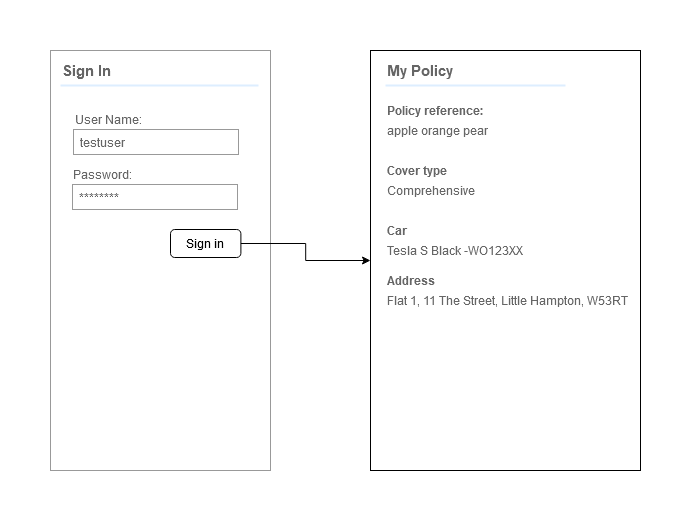
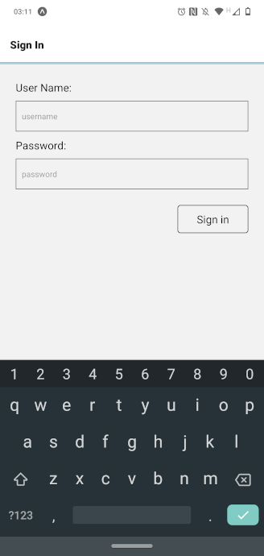
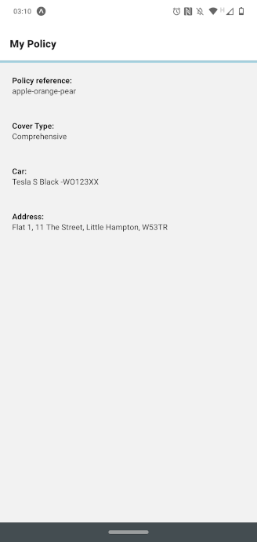

## By Bits Code Challenge

### User Story

As a policy holder

I can login successfully and view my current policy information

So that I can view my policy details

### Wireframe

### Decisions

The wireframe has been used as a strict requirement matching colour, layout, appearance and functionality (for instance removing back navigation button).  

No login authorisation or user storage has been setup.  

No validation required on login details, though button is disabled if either username or password input is missing.  

No logout functionality has been included. Also user sessions are not stored as per challenge notes.  

Stylesheets have been included on components - the project was getting close to the stage where separation of stylesheets into a separate file/files would be better for maintainability.  

App has been run on android phone, iOS simulator (iPhone 11) and web but not specifically checked for different sizes of phones.

### Testing

Spent a lot of time setting up testing environment as I wanted to practice TDD in React Native.  
TDD driven by the end to end Detox test user the wireframe as a guideline.   
Jest used for testing component and screen rendering.

### Time

Approx. 10 hours total:  
5 hours spent setting up testing environment. Detox configuration especially caused a few issues and git stashes as I found the documentation to be slightly different to requirement.  
1 hour spent blocked/debugging passing parameters via navigation stack (hadn't destructured parameter).  
1 spent trying to render CustomerScreen component in testing due to undefined parameters.  

### Dependencies

Development/Testing - Jest, Enzyme, Detox  
Build - Expo, React Navigation

